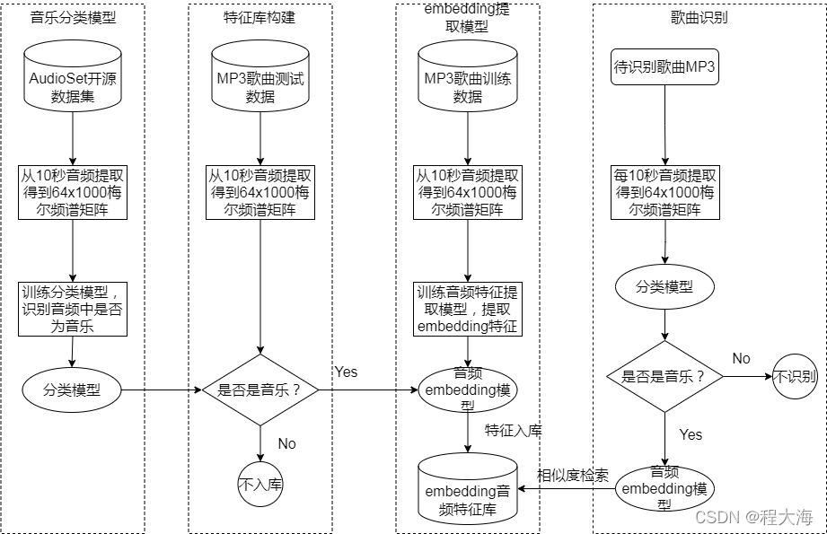

# AudioEmbeddingExtraction
基于度量学习方法训练音频片段embedding特征向量提取模型，可以用于说话人身份识别，音乐片段识别等场景

# 相关文章
## 从零搭建音乐识别系统介绍
* [从零搭建音乐识别系统（一）整体功能介绍](https://blog.csdn.net/cxx654/article/details/122387228?spm=1001.2014.3001.5502)
* [从零搭建音乐识别系统（二）音频特征提取](https://blog.csdn.net/cxx654/article/details/122387542?spm=1001.2014.3001.5502)
* [从零搭建音乐识别系统（三）音乐分类模型](https://blog.csdn.net/cxx654/article/details/122390476?spm=1001.2014.3001.5502)
* [从零搭建音乐识别系统（四）embedding特征提取模型](https://blog.csdn.net/cxx654/article/details/122391804?spm=1001.2014.3001.5502)
* [从零搭建音乐识别系统（五）embedding特征提取模型验证](https://blog.csdn.net/cxx654/article/details/122440716?spm=1001.2014.3001.5502)

## 相关损失函数和数据增强方法
* [度量学习DML之Contrastive Loss及其变种](https://blog.csdn.net/cxx654/article/details/122157804?spm=1001.2014.3001.5502)
* [度量学习DML之Triplet Loss](https://blog.csdn.net/cxx654/article/details/122158015?spm=1001.2014.3001.5502)
* [度量学习DML之Lifted Structure Loss](https://blog.csdn.net/cxx654/article/details/122158090?spm=1001.2014.3001.5502)
* [度量学习DML之Circle Loss](https://blog.csdn.net/cxx654/article/details/122158148?spm=1001.2014.3001.5502)
* [度量学习DML之Cross-Batch Memory](https://blog.csdn.net/cxx654/article/details/122158281?spm=1001.2014.3001.5502)
* [度量学习DML之MoCO](https://blog.csdn.net/cxx654/article/details/122158310?spm=1001.2014.3001.5502)
* [数据增强之SpecAugment](https://blog.csdn.net/cxx654/article/details/122158379?spm=1001.2014.3001.5502)
* [数据增强之MixUp](https://blog.csdn.net/cxx654/article/details/122158435?spm=1001.2014.3001.5502)

# 基于embedding的音乐识别系统整体结构

# 代码结构
* config 配置文件
* models 网络模型
* preprocessing 数据预处理，音频原始特征提取等
* utils 数据处理工具，包括DataLoader数据加载，大规模训练数据加载，定义loss，mixup数据增强，transform数据转换
* model_export.py 将pytorch模型导出为onnx
* train_classifier_model.py 训练音频分类模型
* train_embedding_model.py 训练embedding提取模型
* model_inference.py 模型推理